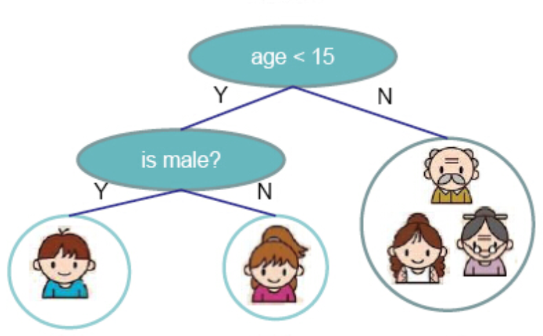

# CS315B-Project: Parallel Binary Decision Tree Construction

> Course Project for CS315B - 2017 Autumn - Stanford
> Student: Li Deng 

### Target

> Implement a parallel computation of Binary Decision Tree in `regent` based on CART(Classification and Regreee Tree) algorithm

### Scope

- Class labels: binary (0 or 1)
- Number of Features: fixed number 
- Type of Features:  numeric 
- Classification Metric: `Gini` index 

- No regression 

### Algorithm 

Source:  http://homes.cs.washington.edu/~tqchen/pdf/BoostedTree.pdf

### Reference
- [Parallel Gradient Boosting Decision Trees](http://zhanpengfang.github.io/418home.html)
- [Exploiting Parallelism in Decision TreeInduction](https://www.dcc.fc.up.pt/~fds/FdsPapers/w2003_ECMLW7_namado.pdf)
- [Parallel Random Forest](https://kirnhans.github.io/15418-project/)
- [A parallel Random Forest implementation for R](chrome-extension://oemmndcbldboiebfnladdacbdfmadadm/http://www.hector.ac.uk/cse/distributedcse/reports/sprint02/sprint02_rf.pdf)
- [ranger: A Fast Implementation of Random Forests](https://www.google.com/url?sa=t&rct=j&q=&esrc=s&source=web&cd=4&cad=rja&uact=8&ved=0ahUKEwjc-Mbl47nXAhVLhlQKHVcLDJIQFghAMAM&url=https%3A%2F%2Farxiv.org%2Fpdf%2F1508.04409&usg=AOvVaw3DOLF8uZtS__n1-hobJAiU)
