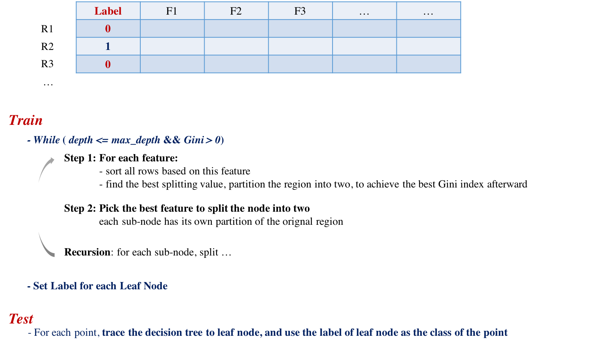

### Stanford CS315B-Project
# Parallel Binary Decision Tree Construction

> Course Project for CS315B - 2017 Autumn - Stanford

> Student: Li Deng 

### Target

> Implement a parallel computation of Binary Decision Tree in [`Regent`](http://regent-lang.org/) based on [CART](https://en.wikipedia.org/wiki/Predictive_analytics#Classification_and_regression_trees_.28CART.29)(Classification and Regreee Tree) algorithm


### Scope
-----------------
- Binary Class labels (0 or 1)
- Fixed Number of Features
- Numeric Features
- No Regularization 
- Classification Metric: `Gini` index 


### Algorithm 

<div style="margin-top:4em"></div>

</div>

### How to Run

- `clone`:

```  
git clone https://github.com/dengl11/CS315B-Project
cd CS315B-Project
```  

- Run `regent` script:

```  
cd regent

# adult-tiny dataset - sequential 
make adult_tiny
# adult-tiny dataset - parallel 
make p_adult_tiny

# adult-medium dataset - sequential 
make adult_medium
# adult-medium dataset - parallel 
make p_adult_medium

# adult-large dataset - sequential 
make adult
# adult-large dataset - parallel 
make p_adult
```  

- Run `python` script:

```  
cd python
python3 adult_classification.py
```  


### [Presentation](https://github.com/dengl11/CS315B-Project/blob/master/doc/CS315B_Project_Presentation.pdf)


### Repo Structure

```  
├── README.md
├── data
│   ├── Makefile
│   ├── README.md
│   ├── adult
│   │   ├── adult_test.tsv
│   │   ├── adult_test_medium.tsv
│   │   ├── adult_test_mini.tsv
│   │   ├── adult_test_small.tsv
│   │   ├── adult_test_tiny.tsv
│   │   ├── adult_train.tsv
│   │   ├── adult_train_medium.tsv
│   │   ├── adult_train_mini.tsv
│   │   ├── adult_train_small.tsv
│   │   ├── adult_train_tiny.tsv
│   │   └── original
│   │       ├── adult.csv
│   │       ├── adult.data.txt
│   │       └── adult.test.txt
│   ├── cancer
│   │   ├── cancer_test.tsv
│   │   └── cancer_train.tsv
│   └── iris
│       ├── README.md
│       ├── iris_full.csv
│       ├── iris_test.tsv
│       └── iris_train.tsv
├── doc
│   ├── CS315B_Project_Presentation.pdf
│   ├── alg.png
│   ├── dt.png
│   ├── report.md
│   └── spy
│       ├── large_d2_p4.pdf
│       ├── medium_d_4.pdf
│       └── medium_no_mapping.pdf
├── preprocess
│   ├── README.md
│   ├── generate_toy_dataset.py
│   ├── lib
│   │   ├── __init__.py
│   │   ├── dataframe_preprocessor.py
│   │   └── util
│   │       ├── __init__.py
│   │       ├── logger.py
│   │       └── plotter.py
│   ├── preprocess_adult.py
│   └── util.py
├── python
│   ├── README.md
│   ├── ValidateMyTree.ipynb
│   ├── adult_classification.py
│   ├── adult_sklearn.py
│   ├── my_classification.py
│   ├── my_decision_tree.py
│   └── sklearn_classification.py
└── regent
    ├── CONFIG.rg
    ├── Makefile
    ├── README.md
    ├── analysis
    │   └── tiny_d2_p4.md
    ├── decision_tree_classifier.rg
    ├── decision_tree_classifier_no_mapping.rg
    ├── decision_tree_config.rg
    ├── decision_tree_lib.rg
    ├── decision_tree_parallel_classifier.rg
    ├── decision_tree_parallel_classifier_no_mapping.rg
    ├── field_space_lib.rg
    ├── out
    │   └── adult
    │       ├── adult_event.log
    │       ├── large.log
    │       ├── medium.log
    │       ├── mini.log
    │       ├── seq.log
    │       ├── seq_large.log
    │       ├── seq_medium.log
    │       ├── seq_tiny.log
    │       ├── tiny.log
    │       └── tiny_nm.log
    ├── run_pbs.sh
    └── util.rg
```  


### Reference
-----------------
- [Parallel Gradient Boosting Decision Trees](http://zhanpengfang.github.io/418home.html)
- [Exploiting Parallelism in Decision TreeInduction](https://www.dcc.fc.up.pt/~fds/FdsPapers/w2003_ECMLW7_namado.pdf)
- [Parallel Random Forest](https://kirnhans.github.io/15418-project/)
- [A parallel Random Forest implementation for R](chrome-extension://oemmndcbldboiebfnladdacbdfmadadm/http://www.hector.ac.uk/cse/distributedcse/reports/sprint02/sprint02_rf.pdf)
- [ranger: A Fast Implementation of Random Forests](https://www.google.com/url?sa=t&rct=j&q=&esrc=s&source=web&cd=4&cad=rja&uact=8&ved=0ahUKEwjc-Mbl47nXAhVLhlQKHVcLDJIQFghAMAM&url=https%3A%2F%2Farxiv.org%2Fpdf%2F1508.04409&usg=AOvVaw3DOLF8uZtS__n1-hobJAiU)
